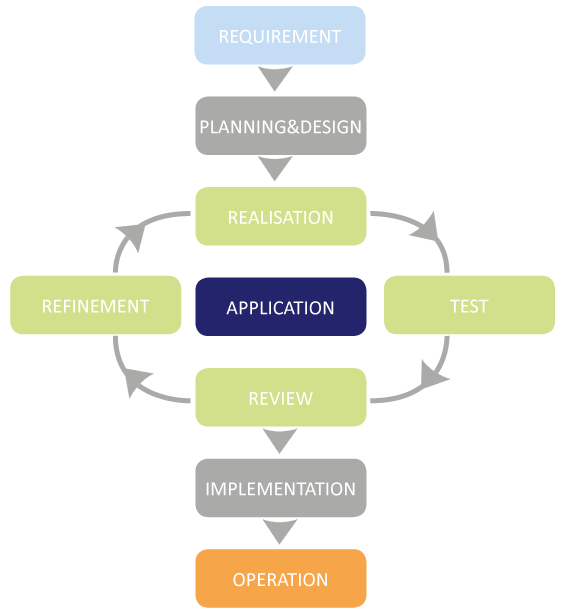
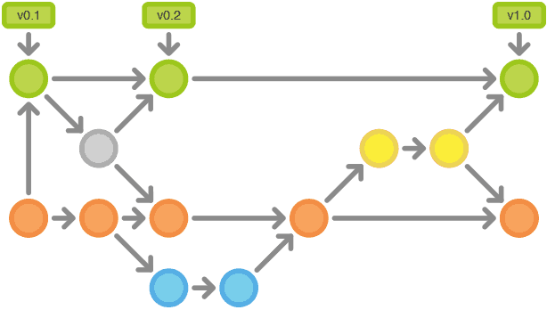
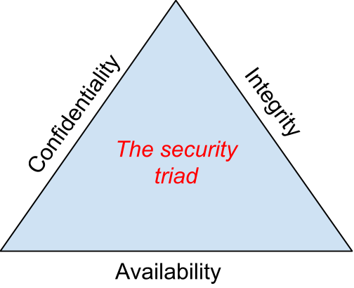

# **T2A1 - Workbook 2**
---

## Table of Content
---

| #   | Content                                                                      |
| --- | ---------------------------------------------------------------------------- |
| 1   | [Brief](#brief)                                                              |
| 2   | [Describe the architecture of a typical Rails application](#question-1)      |
| 3   | [Discuss Rails common database: Pros and Cons](#question-2)                  |
| 4   | [Discuss Agile Project Management](#question-3)                              |
| 5   | [Standard Source Control Workflow](#question-4)                              |
| 6   | [Standard Testing Process](#question-5)                                      |
| 7   | [Discuss and Analyse Information Security](#question-6)                      |
| 8   | [Discuss Common Data Protection Methods](#question-7)                        |
| 9   | [Legal Obligations](#question-8)                                             |
| 10  | [Describe Structural Relational Database Model](#question-9)                 |
| 11  | [Describe Integrity Aspects of the Relational Database Model](#question-10)  |
| 12  | [Describe the Manipulate Aspects of Relational Database Model](#question-11) |


## Brief

---

The ACME Corporation is interested in building a marketplace web application (app) using Rails for one of it’s product lines. To help it choose the vendor who will undertake the project they have released a RfQ. As an aspiring junior dev at an up and coming Sydney software startup (CAx-Dev) your manager has assigned you to assist with preparation of the RfQ response.

You are assigned (required) to complete all the questions from the technical section of the RfQ - which are presented below.

Being a highly valued junior dev you are expected to continue working on your other ongoing projects and schedule time for this project accordingly.

## Question 1: 
Describe the architecture of a typical Rails application.

---


Ruby on rails typical architecture revolve around the usage of the Model-View-Controller (MVC) architecture in the development of applications, MVC architecture aims to improve the maintainability of applications. MVC software design pattern is one of most frequently used web development framework in the industry, it allow developers to create a scalable project by separating the application development into three main logical components with each component built to handle different aspect of the applications. 

#### Model
---
The Model layer is responsible for the business logic of the application and the rules that govern how the data is being manipulated. In a typical Rails application the model main purpose is to manages the interaction with corresponding elements within the database table, overall the model is the representation of information within the application which allows developers to establish relations and validations for appropriate data in the database.

#### View
---
The view is the front-end of the application, in a simple term it is what the users of an application see when they interact with the application. In Rails the view are html files with embedded ruby codes, most ruby codes within the view are simple conditional statement of loops to display information to the users. The main purpose of the view is to provide relevant data to the browser when web pages are requested by a user, the controller renders information through the view and the view would display the appropriate data to the user within the browser.

#### Controller
---
The controller can be consider the conductor within a Rails application if Rails was an orchestra. The main purpose of the controller is process requests from the browser, interact with the model to perform CRUD actions or retrieve the data from the model. Once the data requested from the controller is then passed to the view which render the information to the user through the browser.

#### Route
---
RESTful architecture style is implemented by default in Rails, Rails provide developers with ability to create a RESTful routes through the use of resources key way in route.rb which implement CRUD route for the associated model. Developer are given the ability to customizes the route to perform action relevant to their application by defining appropriate routes for the model.

```ruby
# Rails resource key word that create CRUD routes for the users model
resources: :users

# Limiting routes to only have index, and show page which give developer customize their own routes for that model
resources: :users, only: [:index, :show]

# For developer who want to assign route without using the resource key word
get "/users", to: "users#index"
```

Using Rails resource key word provide the following routes:


Resources:

- https://adrianmejia.com/ruby-on-rails-architectural-design/
- https://medium.com/podiihq/understanding-rails-routes-and-restful-design-a192d64cbbb5
- https://guides.rubyonrails.org/routing.html

## Question 2: 
Identify a database management system (DBMS) commonly used in web applications (including Rails) and discuss the pros and cons of this database.

---

#### PostgresSQL
---

PostgreSQL is a powerful and popular database system among Rails developers, PostgreSQL is a open-source object-relational database with origin dated back to 1986 as part of the POSTGRES project for the University of California with more than 30 years of active development. PostgreSQL is advertise as a database system that make uses of SQL language with heavy focus on features that safely store data and a scalable data workloads for applications. The main advantage of using PostgreSQL is the extensive documentations that PostgreSQL provide to developers who seek relevant information how to solve problems and the access to community resources and supports due to the popularity of PostgreSQL among the active tech communities.

The Pros and Cons of PostgreSQL:

| Pros                     | Explanation                                                                                                                                                                                                                                                                                     |
| ------------------------ | ----------------------------------------------------------------------------------------------------------------------------------------------------------------------------------------------------------------------------------------------------------------------------------------------- |
| Data Types               | Support many data types from primitives: string boolean numbers, structures: array, range, date/time, document: JSON/JSON, key-value, XML etc                                                                                                                                                   |
| Data Integrity           | built in data integrities and validation such as NULL, UNIQUE, primary key, foreign keys, exclusion constraints and explicit lock                                                                                                                                                               |
| Platform Compatibilities | Having over 30 years of active development meant that PostgreSQL is compatible on all major platforms and is ACID-compliant since 2001                                                                                                                                                          |
| Partitioning             | PostgreSQL allow developers to partition tables which meant that big table can be split into smaller pieces. This allow queries to perform faster through partition pruning                                                                                                                     |
| Security Features        | PostgreSQL boast by many developers as having many security feature to protect the data and important data of users. Some of these features include robust access-control system, numerous type of authentication: GSSAPI, SSPI, LDAP, SCRAM-SHA-256, Certificate, column and row security etc. |

| Cons               | Explanation                                                                                                                                                                                                                                                                                                                             |
| ------------------ | --------------------------------------------------------------------------------------------------------------------------------------------------------------------------------------------------------------------------------------------------------------------------------------------------------------------------------------- |
| Slower Performance | The performance of PostgreSQL can be slower than other database system. The relational structure of PostgreSQL meant that when you query something, it would need to go through different table to access the data, and this will result significant performance loss if there are a large number data stores in each table.            |
| Open Source        | Being an open source project have many perks but can also bring many negative perks along with it. As an open-source program it does not offer any warranty or protection in using the application and being managed by the community meant that it can lack many user-friendly features that we come to expect from other applications |

In conclusion, PostgreSQL is a powerful database system that offer developers the flexibilities to create highly complex database at the cost of performance. The open-source nature of the application meant that anyone can use it without having to pay anything to anyone at the trade off of the protection and warranty that you get from paid application. The popular nature of PostgreSQL meant that developers can interact with the active community for answers to quickly solve problems. Overall PostgreSQL is free and flexible therefore developer should give PostgreSQL a look when considering which database system they need for their application.

Resource:
- https://www.postgresql.org/about/
- https://www.aalpha.net/blog/pros-and-cons-of-using-postgresql-for-application-development/
- https://dataintoresults.com/post/postgresql-for-data-science-pro-and-cons/
- https://www.trustradius.com/products/postgresql/reviews

## Question 3: 
Discuss the implementation of Agile project management methodology.

---

Agile Methodology refer to an alternate approach to project management with the emphasis of breaking down software development into small incremental approach with the prioritization of customer feedback in the development process. Agile methodology begins with interacting with clients to grab the main vision of the application such as details on how the application will be use, what problems the application will solve and the overall expectations of the client. The project team will cycle through planning and adding features to the application incrementally through the collaboration of the client to make informed decision regarding the development direction of the application.



The image above details the typical process in which development team goes in an Agile project management approach. 

The implementation of Agile management is normally break down into numerous that will be explain in detail below:

#### Step 1: Strategy Meeting

The first step normally revolve around setting the overall goals or the end picture of the final product establishing a strategic meeting with all stakeholders to define the vision of the application. The normal process involve asking the client to describe the product through the elevator pitch that details the target audiences, basic details about the product, the problem the product aims to solve in the market, the competitor and the competitive edge of the product.

#### Step 2: Product Roadmap

The vision from step 1 will be implemented into a product roadmap that details how the development process of the application will occurs such as details regarding deliverable date, development timeframe, goals and features. The roadmap is not meant to be a finalize development structure but rather its purpose to provide a loose timeframe to details which break down the application development process into small incremental feature so that developers have goals they need to achieve within a given time. This allow the project to be tackle one feature at a time while implement customer feedback to create an application that relevant to the needs of the client and is usable by the customers. 

#### Step 3: Planning Sprints

Sprints refer to short cycle of development in which goals and specific objects is carried out by the development team to meet the development timeframe set out in the product roadmap. Sprints are normally 1 to 4 weeks in length and progress of the development is track through the use of project management application such as trello which details individual tasks of people within the development team and what they are working on. The team will also do daily standup or micro meeting in the morning where each member would details what they have done, what they are doing that day and any roadblock they have encountered.

#### Step 4: Sprints Review

Reviews enable the senior developer to manage their team to ensure that the development objectives are met for the particular sprint and whether it is up to the expectation of the clients. Agile development process is all about continuous learning and iteration during the development to details what was successful during and what was unsuccessful so that mistake can be avoided in future sprints. 

#### Step 5: Product release

The main aims of implementing Agile development principles to create a minium variable product (MVP) as soon as possible so that it can be release to the public to gather feedbacks on whether it is meeting the expectation of the client. Once a MVP is complete, the development cycle start again to add features or to improve upon and integrating customer feedback into the application so that it is tailored to suit the customer preferences.

Overall these 5 steps highlight the typical development process within an Agile methodology approach to software development, Agile methodology allow developers to meet the expectation of the their client and satisfy the consumers need. It allow companies who implement agile methodology to allocate and delegate development resource efficiently, as oppose to the old development approach where company spent years and years to develop a product that is irrelevant and does not meeting the market need. 

Resources:
- https://plan.io/blog/ultimate-guide-to-implementing-agile-project-management-and-scrum/
- https://www.wrike.com/project-management-guide/faq/what-is-agile-methodology-in-project-management/

## Question 4: 
Provide an overview and description of a standard source control workflow.

---

Source control (or version control) refer to practice of tracking and management of codes during development cycle, source control management allows developer to manages the history of the source code in software project and quickly resolve conflicts when merging contribution from multiple sources. Source control is a vital part of software development which is basic skill for developer who aims to work for in huge projects. Source code management allows to develop to track the progress of their source codes for changes, conflicts or to revert to an older version if there are major bugs. This allow developers to the flexibility to collaborate with other developers in team project to work on different features at once without breaking the application, it also help streamline the development process and provide a centralize hub where the source codes is stored.

There are two general approach to a standard source control workflow

#### Centralized Version Control


Centralized version control workflow refer to situation where each member of the get their own working copy of the source but all member will work from one central repository. Each member will git pull from the centralize repository, make changes and then git commit and push their changes to the repository. The other member will need to repeat the process if they want to update the code base.

#### Distributed Version Control


Distributed version control is the more modern approach where each member will have their working clone of the main repository, as show in the diagram above each member will work and commit to their own repository and only have access to changes if they pull from the main repository. This version control approach allows to developers to work on the application without affecting the repository of other developers. This allow to choose to pull or push changes that they have finalize or review without affect the main repository.

Overall the standard development process involve cloning the repository, making their a separate branch from the main repository, make changes to the source code and merge the code into the main branch for deployment.




Resources:
- https://aws.amazon.com/devops/source-control/
- https://homes.cs.washington.edu/~mernst/advice/version-control.html
- https://www.insiso.co.uk/source-control-development-workflows/


## Question 5: 
Provide an overview and description of a standard software testing process (e.g. manual testing).

---

Software testing is the process to check whether the application actual results matches the expected results, it also ensure that the software is performing defect free and there are no unexpected results occurring in the numerous components of the application. Software involve performing checks to ensure the quality of the software and stressing out the performance of the software to see if the application can handle the expected workload. There are two approach to software testing which involve manual and automated testing. 

Manual refer to tests that are perform by an actual person, the person would have to set the up application and perform tests by clicking or interacting with application to look for bugs and document any unexpected behavior that may occur during the testing process. Manual testing is expensive and time consuming as it involve hiring tester to set up and go through the application features one by one, manual testing can inaccurate due to human errors in typos or omitting steps in the test scripts.

Automated testing refer to tests that perform by machine following test scripts prepares in advance by tester to check the functionality of the application to ensure that it matches the expected results. Although automated testing is more robust and reliable when compared to manual testing, the quality of the automated tests is heavily depended on the quality if the test scripts written by the tester. Automated testing however is the future of software development as it is key component in continuous integration and delivery which allows company to scale and add new features to the application. 

Software testing is the key in ensuring software quality is high, the typical testing process involve discovering and reporting bugs, eliminate the bugs, review the changes to ensure functionality remain the same and continue testing to ensure the results matches the expected results. The current trend of software development is to use test driven development to ensure features are meeting expectation before moving on to the next feature, this emphasis the agile methodology project management approach in software development.

Resource: 
- https://www.guru99.com/software-testing-introduction-importance.html
- https://www.atlassian.com/continuous-delivery/software-testing/types-of-software-testing
- http://agiledata.org/essays/tdd.html

## Question 6: 
Discuss and analyse requirements related to information system security and how they relate to the project.

---

Business have a responsibility to protect the information they receive from customer as they can become a target from malicious cyber attack that aim to steal key information about the business or customer personal information. Information security come with three keys components which often refer to as the information security triad, the three key components are confidentiality, integrity and availability.



#### Confidentiality

Confidentiality can also be refer to as Authorization of data which protect the information by restricting access and only showing data relevant to the user. The essence of confidentiality is to protect the private data of user such as their personal information, only allowing other to see if the original have agree to display the data. An example of this would be in a university course, all student have access to information regarding class however student should only be able to see their own grades. 

#### Integrity

Integrity refer to the legitimacy of data represented in the database, the data that is accessed by user should represent what is intended and that the data have not been alter in way by a third party. An example would be the final grades marked by a teacher, if someone altered the grade before it is release then the integrity of the grade is compromised.

#### Availability

The last part of the information security triad refer to Availability which meant that authorized user should be able to access and modify information in an appropriate timeframe. The company is responsible for provide method to for anyone who wish to make changes to their own personal information, such as having a server running 24/7 so that user can access and alter their information at anytime they wish to do so.

#### Information security tools:

Access Control:
-  Authentication: login system - using devise gem in rails
-  Authorization: restrictions in place to control user access - using a gem like rails_admin or cancancan
-  Password Security: Making employee change password frequently, having complex password and training them to not give away password
Data Protection:
- Encryption: Data encryption in place to protect sensitive information through encoding the data upon transmission or storage 
- Security Key: Having public key and private key to ensure that only authorized personnel have access to information relevant to their task and no more
- Back up system: Company must ensure that there are backup server in place to store and maintain the database, having an off-site server or multiples server protect the data from unforeseeable event such as a fire or earthquake.
Network Security:
- Firewall: Company must have a good firewall in place to act as barrier in filtering on-going traffic from and out of the company, this allow unknown packets to be intercept before it penetrate and compromise the company server.
- Virtual Private Network: VPN is a common practice for company to protect from out threat, VPN allow company activity to be invisible to the outside world as it encrypt and mask the IP of the company. 

These are some of information security tools a company can use to protect from malicious cyber attack, it is ultimately up to the company to decide how they wish to protect their database by having a well documented information security policies in place.

Resource:
- https://bus206.pressbooks.com/chapter/chapter-6-information-systems-security/
- https://www.techopedia.com/definition/24840/information-systems-security-infosec

## Question 7: 
Discuss common methods of protecting information and data and how you would apply them to the project.

---

There many way to protect the data and information in a Rails project, the best way to start to research the best practice of other Rails developers and follow what is best for the project. Rails also include many security helper by default to help developer ensure that they are protecting valuable data from malicious cyber attack such have having strong params in the controller, validations in the model and sanitizer for html and css input to protect from SQL attack.

**HTTPS** is now a common practice for developer to include in their web application to protect sensitive information, if an application still use HTTP then attacker easily identify the password of the user as it is shown in clear text. HTTPS is easily enforced in Rails application though the production.rb in the config directory by enabling the following.

```ruby
config.force_ssl = true
```

**Session hijacking** is a common threat in many modern web application as it allow the attacker to steal the session ID from a user and login to the web application in that user's name to gather or steal personal information such as credit details or personal address. One of the best practice when working on a Rails project to install gem such Devise which provide the industry best practice for user authentication into the application as oppose to rolling your own version of authentication when starting out. Devise authentication gem come with session management which create session when a user sign in and destroy the session when they log out. This protect the application from potential session hijacking from cyber attacker, Devise also come with a solid documentations for developer to implement features or maintain their application.

**Cross Site Request Forgery (CSRF)** is also common among cyber attacks, Rails have built-in protection in their form helper which add an authenticity token on forms which only allow user to make a POST request on form if they have the correct token. 

Developer should a checklist to go through which indicating a clear method on how they will protect and maintain the information security of their web application.

Resource:
- https://guides.rubyonrails.org/security.html
- https://github.com/heartcombo/devise
- https://blog.engineyard.com/ruby-on-rails-security-checklist

## Question 8: 
what your legal obligations are in relation to handling user data and how they can be met for the project.

---

There is a legal requirement for company to handle user information in safe and secure manner under Australia Privacy Act 1988 (Privacy Act), company must dispose customer's information when they are no longer require which include shredding the data completely or storing the data in a secure storage. 

For this project, the company should include a privacy policy pages that document the policies in what type of information will collected from the user, how and why these information is needed, how long the information is retain by the company and what steps the customer need to take if the have any questions or concern regarding the information collected. The OAIC have listed guideline on how a company should prepare their privacy policy to ensure they meet the legal requirement from the government in handling user personal information. [OAIC Privacy Policy guideline](https://www.oaic.gov.au/privacy/guidance-and-advice/guide-to-developing-an-app-privacy-policy/).

The first step in starting the Rails project is to identify what type of data the application will need from the user, determine if the data is personal data (Name, Sex, Address etc ) or data relating to other field such as financial or health related. The company must then draft a privacy policy which will details the steps they will take when handling the data collected from the user, the policy should include how the data will be stored and there are sufficient plan in place to protect the data such as encryption, access control and back up system.

Company have a solid plan of action in place to details the steps that are taken in case of a data breach, by having sound privacy policy in place employees are able to efficiently. It is an legal obligation of company to protect user data whether the application is big or small, developer must alway follow protocols set by ACMA and ensure there are sufficient policies in place to protect sensitive data when handling user's data.

Resource:
- https://www.business.gov.au/Risk-management/Cyber-security/How-to-protect-your-customers-information
- https://iclg.com/practice-areas/data-protection-laws-and-regulations/australia
- https://www.oaic.gov.au/about-us/our-corporate-information/key-documents/privacy-policy/
- https://www.oaic.gov.au/privacy/guidance-and-advice/guide-to-developing-an-app-privacy-policy/

## Question 9: 
Describe the structural aspects of the relational database model. Your description should include information about the structure in which data is stored and how relations are represented in that structure.

---

Relational database model refer to a collection of information stored with predefined relationship which allow developer to easily access data. Relation database model have data structure that includes data types, index and views. The data tables is used to store information relating to the objects, with each row hold a unique refer to as keys and each column contains attributes of the data object. Each record will primary key which is unique to the table and foreign keys to represent relationship.

```ruby
# The table represent listing object create in a Rails application
# Rails automatically assign primary key column to the table
  create_table "listings", force: :cascade do |t|
    t.string "name" # This is a column in the data table that represent an attribute of the object
    t.string "brand"
    t.decimal "price"
    t.integer "condition"
    t.boolean "sold", default: false # This represent the different datatypes can be store in a database table, in this case the data is store as boolean with default value of false
    t.bigint "user_id", null: false # This column represent the relational database model indicating that listing belong to a user through users id foreign key
    t.bigint "category_id", null: false
    t.datetime "created_at", precision: 6, null: false
    t.datetime "updated_at", precision: 6, null: false
    t.text "description"
    t.index ["category_id"], name: "index_listings_on_category_id"
    t.index ["user_id"], name: "index_listings_on_user_id" # This indicate the relationship of listing to the user object
  end
```

There are a few type of relational that a data can be represented on in a relation database model.
- One to one relation: User can have only one profile and profile belong to a single user
- One to many relation: User can have many listings while a listing belong to a single user
- Many to many relation: Shopping cart can have many listings and listing can belong to many shopping carts
  - many to many relation is often represented through a joint table such a CartsListings Table within the database which only hold foreign keys to represent the relation of the objects
  
Resource:
- https://searchdatamanagement.techtarget.com/definition/relational-database
- https://www.lifewire.com/database-relationships-p2-1019758

## Question 10: 
Describe the integrity aspects of the relational database model. Your description should include information about the types of data integrity and how they can be enforced in a relational database.

---

Data integrity is set of practical principles that defined how data is store within a database and how relational data is represented. Data integrity can be define as the overall accuracy, completeness, consistency of data and the safety of the data in regard to regulatory compliance. There are two types of data integrity, physical and logical integrity which are collection of processes and methods that enforce data integrity. There are three cores constraints that make up the management of data integrity: Entity, Referential and Domain integrity.

#### Entity Integrity

Entity integrity refer to the creation of primary or unique value that identify each piece of data, primary key ensure that every data being input is represented and there are no duplication of data. This is main feature in relational database model as the primary key is needed to link data between different database table. The main rule for entity integrity is that every table should have an incremental primary key which represent each unique data and that it cannot be null.

#### Referential Integrity

Referential integrity dictate the series of steps that define how the data is being stored and used in a uniform manner. Referential integrity is often refer the foreign key of a relational database model which have two states, the first state is that foreign key is refer to as the primary key of another table to indicate the relational link and the second state it can be a null value but the null value would indicate that there are no relational link or the relationship is unknown. Referential integrity help developers establish relationship between data table, making data accurate, eliminate duplicate and disallow any data that doesn't belong in the table.

#### Domain Integrity

Domain integrity is the constraint that govern the collection of processes to maintain accurate data being store in the column of a data table. Domain refer to the set of value that a column can contain, it ensure that data being store is of relevant datatype and limit the amount of data entered. For instance when a user input a username, the developer can set constraint on the minimum and maximum character allow and whether the user can include integer in their input. 

Resource:
- https://www.techopedia.com/definition/811/data-integrity-databases
- https://www.talend.com/resources/what-is-data-integrity/

## Question 11: 
Describe the manipulative aspects of the relational database model. Your description should include information about the ways in which data is manipulated (added, removed, changed, and retrieved) in a relational database.

---